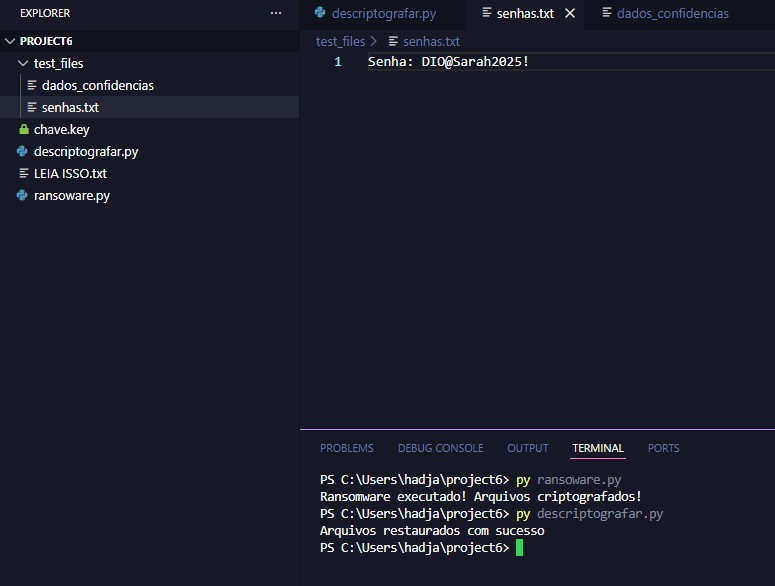
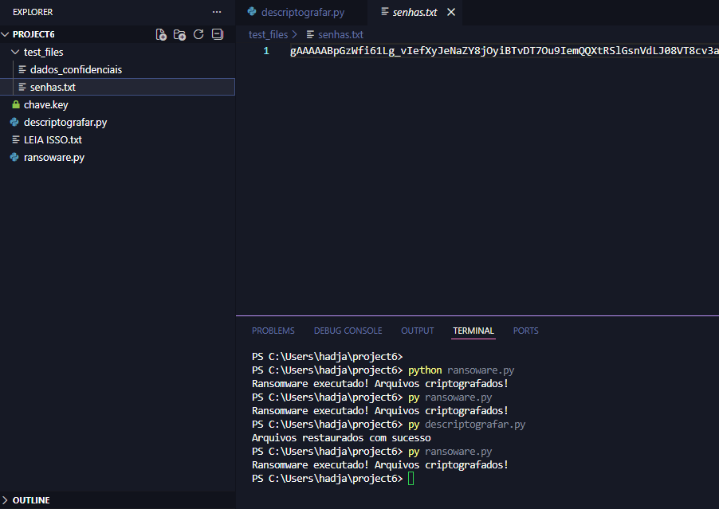

# 🔒 Desafio de Cibersegurança em Python: Ransomware & Keylogger Simulado

Este projeto é uma **implementação educacional** e documentação de malwares simulados (Ransomware e Keylogger) desenvolvidos com Python. O principal objetivo é **compreender o funcionamento prático** dessas ameaças para fortalecer as estratégias de defesa e mitigação, em um ambiente **100% controlado**.

---

## 1. Ransomware Simulado (Criptografia de Arquivos)

Este módulo simula o sequestro de dados ao criptografar arquivos confidenciais usando a biblioteca `cryptography` (módulo Fernet).

### ⚙️ Arquivos e Fluxo

| Arquivo | Função |
| :--- | :--- |
| `ransomware.py` | Gera a chave e criptografa os arquivos-alvo (`senhas.txt`, `dados_confidenciais`). |
| `descriptografar.py` | Utiliza a chave (`chave.key`) para restaurar os dados originais. |

### 📸 Prova de Conceito - Criptografia e Descriptografia

1.  **Criptografia:** O script `ransomware.py` é executado, deixando os arquivos ilegíveis.
2.  **Descriptografia (Restauração):** O script `descriptografar.py` é executado com sucesso, revertendo o processo.



### Detalhe do Arquivo Criptografado

Abaixo, a transformação do conteúdo de `senhas.txt` em dados ilegíveis após a execução do ransomware:



---

## 2. Keylogger Simulado (Captura de Teclas)

Este módulo implementa um registrador de teclas utilizando a biblioteca `pynput` para capturar as entradas do teclado e salvá-las no arquivo `log.txt`.

### ⚙️ Funcionalidades e Furtividade

* **Registro no `log.txt`**: A função `on_press` registra caracteres normais e trata teclas especiais.
* **Filtro `IGNORAR`**: Um conjunto de teclas modificadoras (`Shift`, `Ctrl`, `Alt`) é ignorado para evitar ruído no log.
* **Reflexão**: O problema de **duplicação de caracteres** no log foi identificado no bloco `try` e resolvido ao remover a linha de escrita duplicada do código final.

### 📸 Prova de Conceito - Log de Teclas

A imagem abaixo mostra o arquivo `log.txt` gerado, que registra a entrada de texto e a presença de códigos de teclas especiais (`[ESC]`) após a digitação da senha:


---

## 3. Reflexão e Estratégias de Defesa 🛡️

O entendimento da lógica de ataque é crucial para a defesa. A segurança eficaz deve ser em camadas, abrangendo tecnologia e conscientização do usuário.

| Ameaça | Estratégia de Prevenção/Mitigação |
| :--- | :--- |
| **Ransomware** | **Backup 3-2-1:** Mantenha múltiplas cópias de dados em locais isolados. / **Isolamento de Rede:** Use sandboxing e segmente redes. |
| **Keylogger** | **Gerenciadores de Senha:** Use preenchimento automático para evitar a digitação manual de credenciais. / **Antivírus Comportamental:** Detecta e bloqueia a captura de teclado e a comunicação de dados suspeita. |
| **Vulnerabilidade Humana** | **Conscientização:** Treinamento regular para identificar phishing, engenharia social e anexos maliciosos. |

---

## 4. Como Usar o Projeto

### Pré-requisitos
```bash
pip install cryptography pynput
